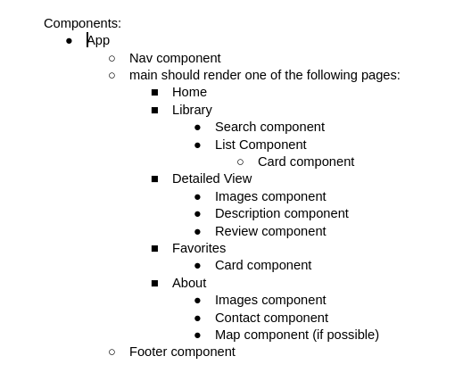
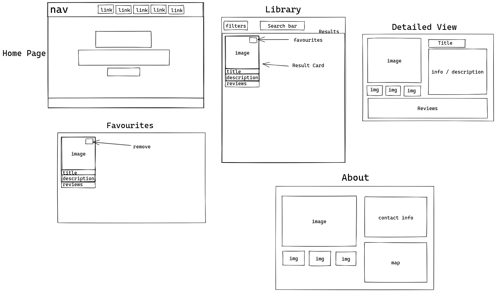
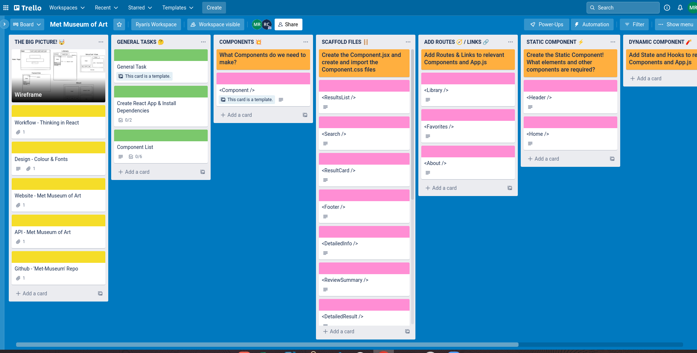
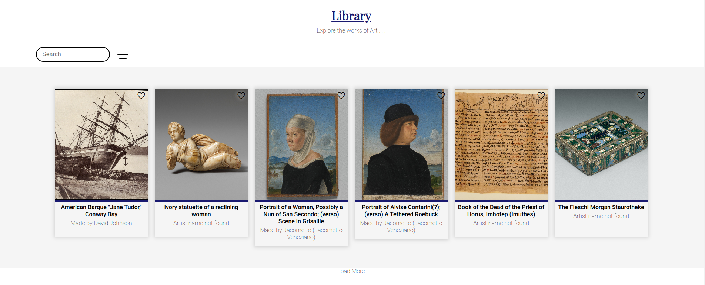

# Project 2: Met-Museum 

## Description
This Met Museum app was created for art lovers. It allows the user to view the artworks found in the Met Museum API. There are also functionalities in the app to make the user experience interactive. 

## Deployment Link
You can find the deployed app here:
[MetArt](https://scintillating-lollipop-ac4c7e.netlify.app)

## Timeframe and Working Team:
This project, which was pair coded, had a timeframe of 10 days. 

## Technologies Used
- HTML
- CSS 
- JavaScript
- React
- npm
- Chrome’s Developer Tools
- Visual Studio Code
- Trello
- Excalidraw
- Met Museum of Art API

## Brief 
The brief for this project stated that our app must:
- Consume a public API
- Include a router with several pages
- Include wireframes
- Have semantically clean HTML
- Be deployed online

## Planning
We started our planning by browsing through a number of public APIs. Because of the large number of options, we had some difficulties settling on one idea, so we decided to give a list of ideas. We gave up on some of the ideas because of the timeframe we had or because the APIs needed for those ideas were not well maintained. After some deliberation and a talk with our instructors, we decided to create an app using the Met Museum API.

### Choosing the Components
The first thing we did once we had decided on the app we would make was structuring our page. We then chose our main components. We started off by deciding on the number of page components we wanted. We then listed the child components of each page component.



### Wireframe
After discussing the components we would need for our project, we used Excalidraw to draw the wireframe of our app. 



### Trello 
Once we were done with the wireframe, my partner created a Trello board. He created the backbone of the Trello board, and I helped him list the components and their use. 



### Dividing the Tasks
Once we finished the planning, we discussed how we were going to divide things. We decided to work on certain components together and on others individually. I then created a git repo for our project. Throughout the project, we met regularly in the evenings through zoom. During those meetings, we would discuss our progress and any bugs we were having.

| Paired Tasks      | My Task | Partner's Task |
| ----------- | ----------- | ------------------|
| File creation   | Favorites Page      | Detailed View Page |
| Page routing    | ResultsList Component | Review |
| Navigation Bar | ResultCard Component | About Page |
| API fetching | Load More Button | ImageViewer Component |
| Search bar functionality | Footer | Filter Buttons
|                          |        | Search Bar |
| | |


## Code Process

### App.js
To start, my partner and I decided to work together on App.js. We discussed the states we would need, and we did the fetch for the API together. We also created the navigation bar and the routes to the different pages. Once we made sure that we could navigate to different pages, we started working on our own tasks.

### ResultsList & ResultCard
To begin, I started working on the ResultsList and ResultCard components. Before working with the data that was fetched directly from the API, I decided to copy some of the data from the API and saved them in a file. The reason I did this was so I could have some dummy data I could work with. To fetch the dummy data, I used Insomnia to do a fetch request. I chose to use the hardcoded data at the beginning instead of using the fetched data from the API. 


In the ResultsList component, I mapped over the artworks, and for each of the artwork, I would return a ResultCard for that artwork. 


```
{ props.artwork ?
    props.artwork.slice(0,props.load).map((art) => {
        if (art.primaryImage !== "") {
        return (
            <ResultCard staticData={props.staticData} favorites={props.favorites} setFavorites={props.setFavorites} reviews={props.reviews} setReviews={props.setReviews} 
            artKey={art.objectID} src={art.primaryImage} title={art.title} displayName={art.artistDisplayName} clickHandler={() => addFavorite(art)} 
            key={art.objectID} icon={"favorite"} className={(props.favorites.includes(art)? "favorite": "")}
            />
            )
          } else {
        return <></>
        }
    }) :
<>Creating Artwork 🎨</>}
```


The ResultCard returns an image, the title of the artwork, and the name of the artist. In some cases, there was no artist name, so I had to return “Artist name not found.” When the ResultsList and ResultCard were working well, I stopped using the hardcoded data and used the data fetched directly from the API instead. 



### addFavorite & removeFavorite
Once I was able to display the artworks, I decided to refactor my code. At that moment, the ResultCard was made specifically for the ResultsList. However, I wanted to make the ResultCard reusable so that I could use it again in the favorite page and so that I could run different functions on the favorite/remove icons depending on where the ResultCard was used. 

To refactor my code, I decided to pass the data, such as the image url, the artwork title, and the artist name as props to the ResultCard. 

After I was done refactoring my code, I created the addFavorite function in the ResultsList component and the removeFavorite function in the favorite component. Those functions were passed down as props in the ResultCard, and they were run when the favorite or remove icons were clicked. 

```
function addFavorite(art) {
    const favoriteList = [...props.favorites, art]
    const noDuplicateList = [...new Set(favoriteList)]
    props.setFavorites(noDuplicateList)
}

function removeFavorite(index) {
    const newFavList = [...props.favorites.slice(0, index), ...props.favorites.slice(index + 1)]
    props.setFavorites(newFavList)
}
```

### Search
When my partner and I were somewhat done with our components, we started working on the search component together. To manually search for a specific work or art, we used a search state. We decided to add an onChange event in the search bar component that would update the search state every time. 

Once we were able to confirm that the state was being updated, we rewrote the fetch url using backticks instead of double quotes. We then substituted a part of the url with the search state, and we added the search state as a dependency in the useEffect hook.

We repeated the same actions for the filter buttons. However, instead of using onChange we used onClick. 

Once the main functionalities of the app were working, my partner updated the CSS for our app. 

### Load More
Originally, our app only displayed the first 10 artworks. We did so by slicing off the first ten elements. Since our app was originally created in such a way that only the top 10 artworks were displayed, I decided to add a load more button. 

To create a load more button, I created a new state called load which I initialized to 10. I passed the load state to the slice and the setLoad to the load more button. I made it so that when the load more button is clicked, it would add 10  to the current load state. 

Although the load more button was working, it was not written in the best way possible. When my partner and I worked on the finishing touches of the project, we decided to update the load more button to fetch the next 10 artworks instead of the previous load more button, which was fetching all the artworks all over again. 

### Posting Reviews
We had issues with posting the reviews, so we asked our instructor for help. The issue was that the review state was not updating when we clicked on the post button. The reason was because we were setting the review state as an object when it was initialized as an array. To fix the issue, we used a spread operator to add the object to the review state, and we rendered the review props in the Review component, which we did not do previously. 

### Footer
Once we had our main functionalities working, I created the footer for the app. I wanted to add 
social media icons with links in the footer. To do so, I installed 3 font awesome packages. I then added and styled the social media icons. 

## Challenges

### Search and Filter
The biggest challenges we faced during this project were the search bar and the filter buttons. We had a lot of issues displaying the right artworks for the right search or filters, especially for the filter buttons. We had a lot of issues with the functionality of the search bar and filter buttons. 

### Pair Programming
Our app had a lot of components that were interconnected together. Because of that, we had trouble working on our individual tasks. To overcome this challenge, we decided to hold zoom meetings outside of class. 

## Wins

### Adding to/Removing from Favorite
Another aspect of the code I am proud of is the functionality to add and remove an artwork to and from the favorite page. It makes the user experience more interactive.

### Adding Reviews
The ability to add a review to a particular artwork was also a win. 

## Key Learnings

### State and Props
Although I had already been familiar with using state and props, I was not very comfortable using them. However, with this project, I was able to deepen my understanding of these two, especially props. I used to have difficulties using props, and it made coding uncomfortable. However, I am now a lot more comfortable using props and passing down states. 

### Pair Programming
Pair programming seemed daunting to me at first. However, after working with my partner, I found this to be a very fruitful experience. I was able to learn how to use Live Share in VS Code. I also became more comfortable discussing my code and problems I had. Overall, I think I learned a lot coding alongside my partner. 

### Reusable Component
I was able to create my first reusable component during this project, which was ResultCard. I was able to use it in both the Library and Favorites page. 

## Bugs

### Search
While deploying our app, we ended up breaking the search functionality, which was previously working. 

### Filter Button
It is currently not possible to have two filters working at the same time. When two filter buttons are used at the same time, no artwork will be displayed. 

## Future Improvements

### Filter Artworks
Currently, we are only displaying the artworks that have pictures after we slice. If we slice 10 elements, and want to display those 10 elements, if one of them does not have an image, only 9 will be displayed. I hope to improve the code so that we could filter out the artworks that do not have images before doing the slice. 

### Filter Buttons
As I mentioned earlier, we have a bug concerning the filter buttons. I hope to improve the app so that two or more filters can be used at the same time. 

### Search Function
Our search function broke, so I hope to fix and improve it. 